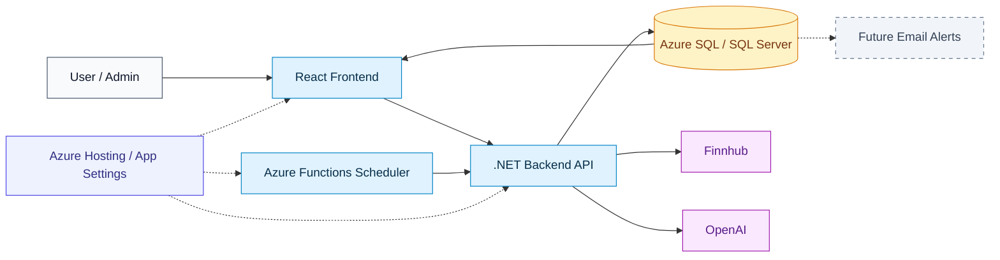

# AlphaMind System Map

This diagram is the high-level architecture overview. It intentionally avoids backend internals so the whole system can be understood on one screen.

## Notes

- The React frontend is the user-facing application for dashboards, analyses, and stock administration.
- The .NET backend API owns application logic, integration calls, scheduler endpoints, and database access.
- Azure Functions triggers the scheduled analysis flow by calling protected backend endpoints.
- Email alerts are planned future functionality and are shown as a dashed dependency from stored analysis data.
