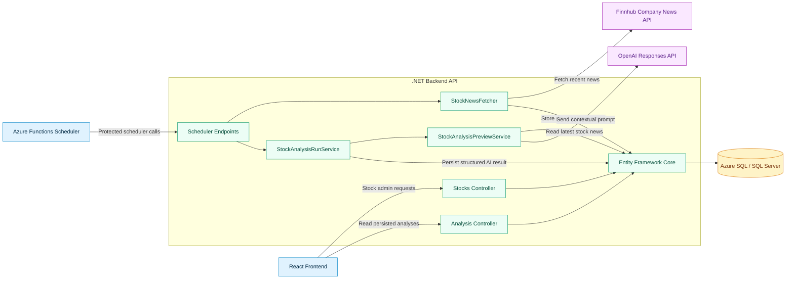

# Backend Flow

This diagram shows the main backend components behind the compact system map. It focuses on controllers, services, integrations, scheduler endpoints, and persistence.

## Component Notes

- `StocksController` manages tracked stocks, including create, update, reorder, disable, and delete behavior.
- `AnalysisController` exposes persisted analysis results for the frontend.
- Scheduler endpoints are protected by `X-AlphaMind-Scheduler-Key`.
- `StockNewsFetcher` loads active non-Stockholm stocks, fetches Finnhub news, deduplicates news, and records fetcher runs.
- `StockAnalysisPreviewService` builds a news-context prompt and requests strict JSON analysis from OpenAI.
- `StockAnalysisRunService` persists AI analysis results as `StockAnalyses` rows.
- Entity Framework Core is the single persistence boundary for SQL Server/Azure SQL access.
