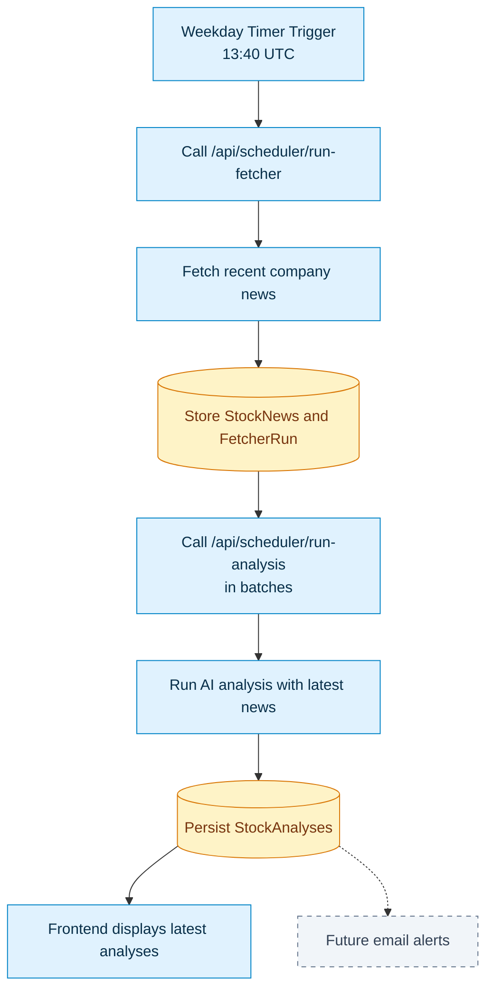

# Scheduled Analysis Flow

This diagram shows the daily scheduled analysis process from timer trigger to user-visible results.

## Flow Notes

1. Azure Functions starts the weekday timer trigger.
2. The scheduler client calls the backend fetcher endpoint with the scheduler key header.
3. The backend fetches recent Finnhub company news for active eligible stocks.
4. News and fetcher run metadata are stored in SQL Server/Azure SQL.
5. The scheduler calls the analysis endpoint repeatedly in batches.
6. The backend builds stock-specific news context and sends it to OpenAI.
7. Structured analysis results are persisted.
8. The React frontend reads persisted analyses from the backend API.
9. Future email alerts can evaluate newly persisted analysis results.
